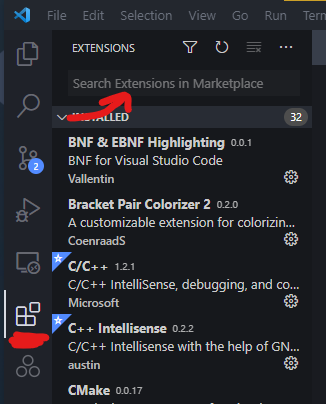

## Zloadaj Code
https://code.visualstudio.com/Download

### Zloadaj Python, če nimaš
https://www.python.org/downloads/

Vsaj 3.8, I guess, ta zadnji je 3.9.2.

## Namesti extensione
- Python
- Live Share

Napišeš ime extensiona not, klikneš install:

## Zloadaj repo
`git clone https://github.com/hackguy25/hashcode2021`

## Odpri Code v mapi
Greš z explorerjem v mapo, ki jo je naredil git.

Desni klik > "Open with Code"
